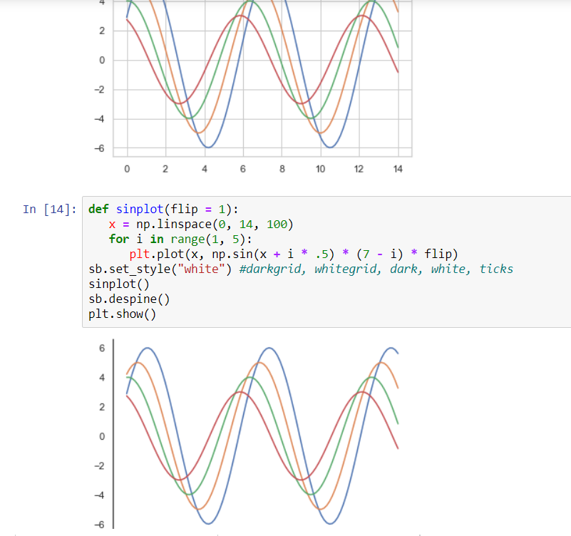
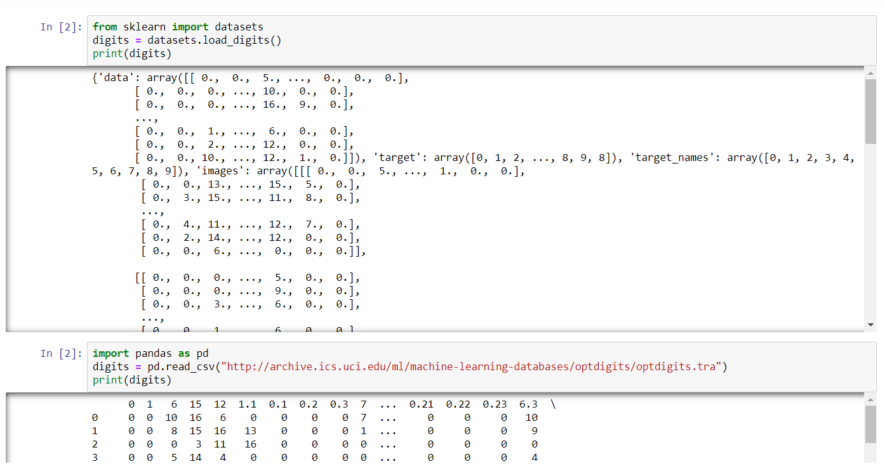
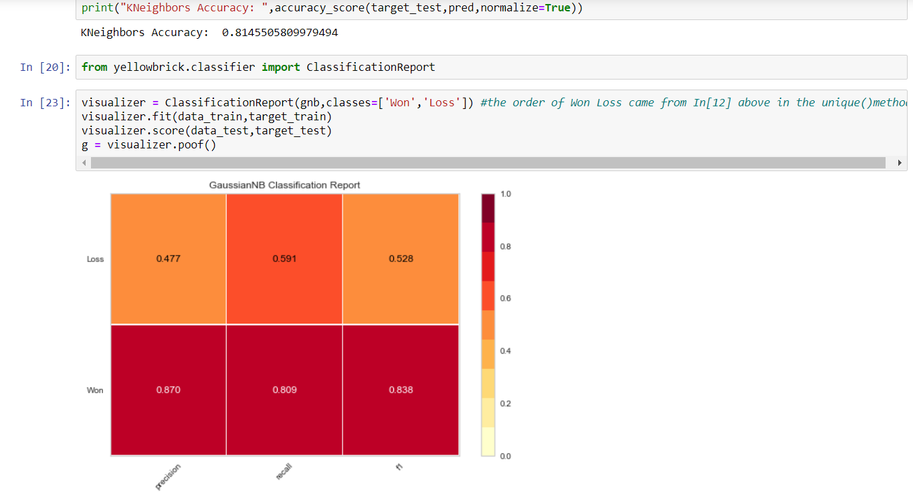

# Python-Machine-Learning-Libraries
Includes machine learning jupyter notebook having numpy pandas seaborn matplotlib sklearn

#### Seaborn-Matplotlib

#### Pandas Data Representation

#### Test Train Split and Summary

